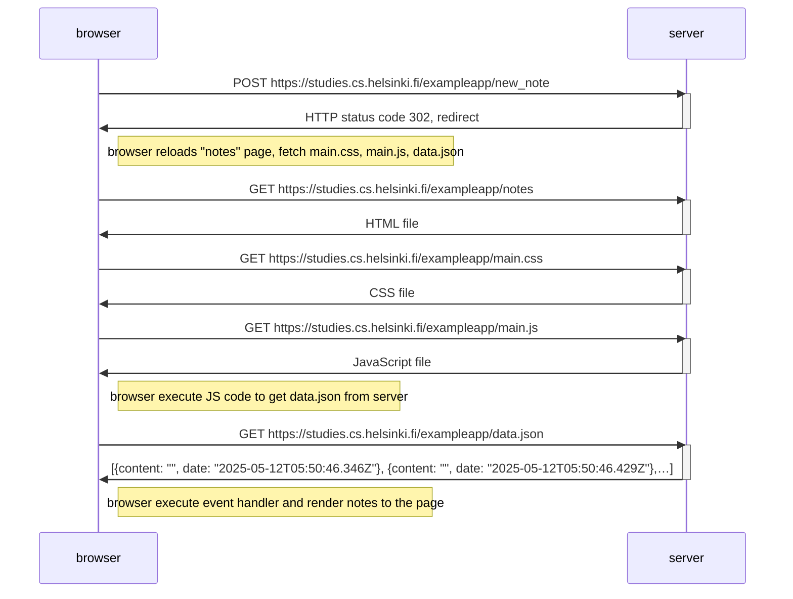

```mermaid

sequenceDiagram
    participant browser
    participant server

    browser->>server: POST https://studies.cs.helsinki.fi/exampleapp/new_note
    activate server
    server->>browser: HTTP status code 302, redirect
    deactivate server

    Note right of browser: browser reloads "notes" page, fetch main.css, main.js, data.json

    browser->>server: GET https://studies.cs.helsinki.fi/exampleapp/notes
    activate server
    server->>browser: HTML file
    deactivate server

    browser->>server: GET https://studies.cs.helsinki.fi/exampleapp/main.css
    activate server
    server->>browser: CSS file
    deactivate server

    browser->>server: GET https://studies.cs.helsinki.fi/exampleapp/main.js
    activate server
    server->>browser: JavaScript file
    deactivate server

    Note right of browser: browser execute JS code to get data.json from server

    browser->>server: GET https://studies.cs.helsinki.fi/exampleapp/data.json
    activate server
    server->>browser: [{content: "", date: "2025-05-12T05:50:46.346Z"}, {content: "", date: "2025-05-12T05:50:46.429Z"},…]
    deactivate server

    Note right of browser: browser execute event handler and render notes to the page
```
