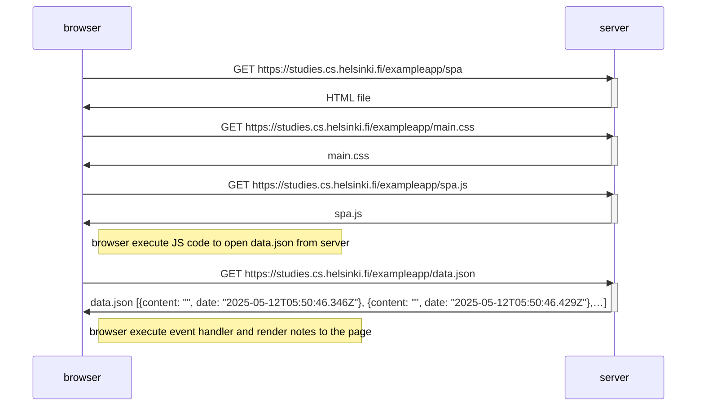

```mermaid

sequenceDiagram
    participant browser
    participant server

    browser->>server: GET https://studies.cs.helsinki.fi/exampleapp/spa
    activate server
    server->>browser: HTML file
    deactivate server

    browser->>server: GET https://studies.cs.helsinki.fi/exampleapp/main.css
    activate server
    server->>browser: main.css
    deactivate server

    browser->>server: GET https://studies.cs.helsinki.fi/exampleapp/spa.js
    activate server
    server->>browser: spa.js
    deactivate server

    Note right of browser: browser execute JS code to open data.json from server

    browser->>server: GET https://studies.cs.helsinki.fi/exampleapp/data.json
    activate server
    server->>browser: data.json [{content: "", date: "2025-05-12T05:50:46.346Z"}, {content: "", date: "2025-05-12T05:50:46.429Z"},…]
    deactivate server

    Note right of browser: browser execute event handler and render notes to the page

```
